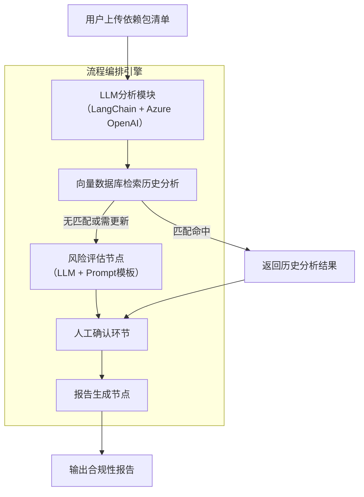
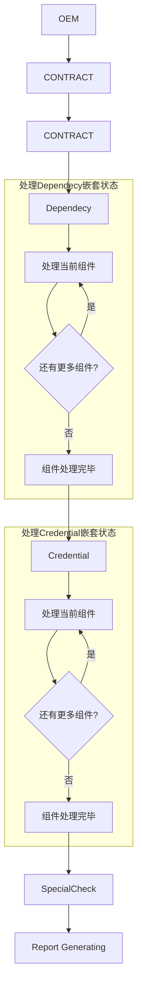

# 合规性风险评估系统（Compliance Risk Assessment System）

本项目基于大型语言模型（LLM）与向量检索技术，结合人工确认环节，实现软件依赖包的合规性风险自动分析与智能评估。核心由LangChain框架驱动，调用Azure OpenAI完成文本分析，结合PocketFlow实现任务节点编排，最终生成结构化合规报告。

---

## 项目背景与目标

随着软件依赖包的数量和复杂度激增，传统人工审核流程效率低、误判率高。本系统旨在：

- 利用LLM自动理解依赖包文本内容及许可协议
- 结合向量数据库实现历史案例快速检索
- 通过多阶段状态机管理合规评估流程（OEM、依赖、合规等）
- 结合人工确认节点保证结果准确可靠
- 最终生成可供法律与开发团队参考的合规报告

---

## 系统架构



* **LLM分析模块**：负责解析依赖包及许可文本，调用Azure OpenAI生成语义向量及初步分析。
* **向量数据库**：存储历史分析结果，提升复用效率。
* **风险评估节点**：对未命中或需更新的条目，重新调用LLM做合规风险评估。
* **人工确认环节**：基于状态机（OEM、依赖、合规、合同等）引导人工逐步确认。
* **报告生成节点**：整合所有确认结果，自动生成结构化合规报告。

---

## 核心模块设计

### 状态机设计


* 采用抽象基类`StateHandler`定义状态处理器接口
* 定义具体状态处理器：`SpecialCheckHandler`, `OEMHandler`, `DependencyHandler`, `ComplianceHandler`
* `WorkflowContext`负责状态管理和转移
* 状态枚举由`ConfirmationStatus`定义，包含`SPECIAL_CHECK`, `OEM`, `DEPENDENCY`, `COMPLIANCE`, `CONTRACT`。
  
状态机大致示意




### 后端聊天服务

* 类`ChatService`负责接收用户输入，调用对应状态处理器处理消息
* 通过`WorkflowContext`维护会话状态和状态转移，该在`ChatFlow`框架下，通过`transition_table`维护节点走向
* 使用`FastAPI`实现接口，提供文件上传分析接口和聊天交互接口
* 开发`ChatManager`支持多组件、许可证依次确认，管理多轮对话上下文

---

## 快速开始

### 环境依赖

* Python 3.9+
* FastAPI
* uvicorn
* LangChain
* Azure OpenAI SDK
* PocketFlow（流程编排）

```bash
pip install -r requirements.txt
```

### 启动服务

```bash
uvicorn back_end.server:app --reload --host 127.0.0.1 --port 8000
```

### 使用流程

1. **上传依赖文件**

通过`npm run dev`在前端根目录运行交互页面，并上传文件。

返回 `session_id` 和初始确认组件信息。

2. **发起聊天确认**

```bash
curl -X POST "http://127.0.0.1:8000/chat/{session_id}" -H "Content-Type: application/json" -d '{"message":"用户输入内容"}'
```

服务器返回当前确认状态和系统回复。

3. **查询会话状态**

```bash
curl -X GET "http://127.0.0.1:8000/sessions/{session_id}"
```

---

## 开发指南

* 关键逻辑位于 `back_end/services/chat_service.py` 与 `back_end/services/chat_flow.py`
* `WorkflowContext` 实现状态转移，易于扩展更多状态
* FastAPI 服务器入口在 `back_end/server.py`
* 日志采用标准`logging`，级别可调节方便调试

### 如何在ChatFlow中新增普通节点？
1. 在`item_types.py`的`ConfirmationStatus`类中新增映射，如`OEM = "OEMing"`即为新增了对于项目类型进行确认的节点
2. 在`chat_flow.py`中新增对应类，比如`OEMHandler`类，以`SimpleStateHandler`类为基类，示例代码如下。
```python
class OEMHandler(SimpleStateHandler):
    def check_completion(self, context: Dict[str, Any]) -> bool:
        print("执行OEM处理...")
        status = context.get('status')
        if status == State.NEXT.value:
            return State.COMPLETED
        elif status == State.CONTINUE.value:
            return State.INPROGRESS
        else:
            raise RuntimeError('Model did not determine to go on or continue')
```
3. 在`WorkflowContext`中的`transition_table`和`handlers`两个属性中分别注册状态转移规则和对应处理器
```python
 transition_table = {
        ConfirmationStatus.OEM: {
            State.COMPLETED.value: ConfirmationStatus.CONTRACT, # 模型判断当前状态结束后的下一个状态
            State.INPROGRESS.value: ConfirmationStatus.OEM # 模型判断继续时停留在当前节点
        }
    }

handlers = {
        ConfirmationStatus.OEM: OEMHandler(), # 注册后，Chatflow能够根据当前状态选择对应的处理器
    }
```
4. 接下来，需要处理Chatbot普通节点状态转移时向用户展示指引的逻辑。此处在`chat_service.py`的`ChatService`类的`status_handlers`属性中注册对应方法
```python
status_handlers = {
        ConfirmationStatus.OEM.value: self._handle_oem,
    }
```
5. 同时，在`ChatService`类中实现该方法
```python
def _handle_oem(self) -> str:
    """处理OEM状态"""
    prompt = self.bot.langfuse.get_prompt("bot/OEM").prompt
    response = get_strict_json(self.bot, prompt)
    return response.get('talking', '请确认OEM信息')
```
6. 最后，在[Langfuse](http://140.231.236.162:8500/project/cmdh3nlkv0005pe07n90sru1k/prompts?pageIndex=0&pageSize=50&folder=bot)平台中创建对应的prompt，命名和代码中`get_prompt()`中的参数一致


### 如何在ChatFlow中新增嵌套节点？
* 基本依靠配置关键文件的方法就能实现更新
1. 确保在`node.py`中已经提前处理了待处理的数据在`shared`中，目前的嵌套节点仅支持`List[dict]`的形式。
```python

# 示例数据
exec_res = [
  {
    "title": "Apache-2.0",
    "originalLevel": "low",
    "CheckedLevel": "low",
    "Justification": "..."
  },
  # 其他待确认
]

shared['toBeConfirmedLicense'] = exec_res

```
2. 在`item_types.py`的`ConfirmationStatus`类中新增映射，如`LICENSE = "license"`即为新增了对于许可证进行确认的节点
3. 在`item_types.py`中的`TYOE_CONFIG`字典中配置映射
```python
# 示例配置

ItemType.LICENSE: {
    "current_key": "current_license_idx", #用于在shared中维护目前确认的item索引
    "items_key": "checkedRisk", # 方便chat_manager去获取item列表，需与在shared中定义的键一致
    "error_msg": "错误：没有找到要确认的许可证",
    "name_field": "title", #在shared的字典中，用来表示待确认的item的名称的键
    "default_name": "未命名许可证",
    "instruction_template": "here is the licenseName: {title}, CheckedLevel: {CheckedLevel}, and Justification: {Justification}", # 用于在大状态中引导模型发送指导用户挨个确认item的指导文
    "instruction_fields": ["title", "CheckedLevel", "Justification"] # 方便chat_manager去找对应信息的placeholder，需与shared中的字典键一致，也需要与上面template的placeholder一致
}


```
4. 在`chat_flow.py`中新增对应类，比如`ComlianceHandler`类，以`SubTaskStateHandler`类为基类，示例代码如下。
   - 需要注意的是在`lic.get()`的部分，需要确保这里的参数应该是在`shared`中item对应的title键
```python
class ComplianceHandler(SubTaskStateHandler):
    def initialize_subtasks(self, context: Dict[str, Any]):
        """初始化待确认组件子任务"""
        licenses = context.get("shared", {}).get(TYPE_CONFIG[ItemType.LICENSE]['items_key'], [])
        # 以组件ID作为子任务标识
        self.subtasks = [lic.get("title", f"lic_{idx}") for idx, lic in enumerate(licenses)]
        logger.info(f"chat_flow.LicenseCheck: 依赖处理: 初始化了 {len(self.subtasks)} 个组件子任务")
    
    def is_subtask_completed(self, context: Dict[str, Any], subtask_id: str) -> bool:
        """检查组件是否已确认"""
        licenses = context.get("shared", {}).get(TYPE_CONFIG[ItemType.LICENSE]['items_key'], [])
        for lic in licenses:
            if lic.get("title") == subtask_id:
                return lic.get("status") == ItemStatus.CONFIRMED.value
        return False

```
5. 在`WorkflowContext`中的`transition_table`和`handlers`两个属性中分别注册状态转移规则和对应处理器（方法与普通节点一致）
6. 此后步骤和普通节点一致，需要实现大状态指导语的prompt


---

## 未来优化方向

* 增加更多智能异常检测与预警策略
* 扩展多语言支持，覆盖更多许可协议语境
* 深度集成知识图谱，提升推理能力
* 接入更丰富的人机交互接口，实现多渠道合规审核
