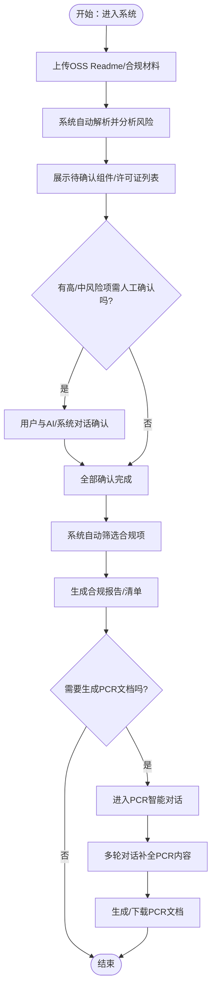
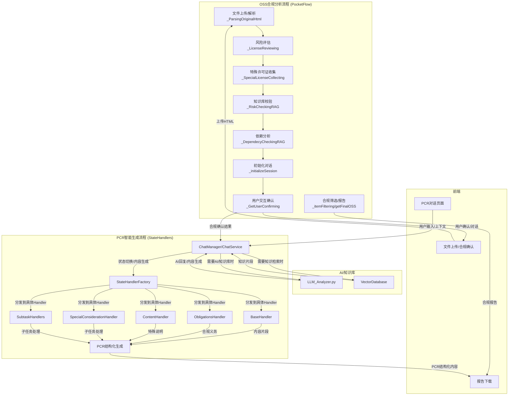
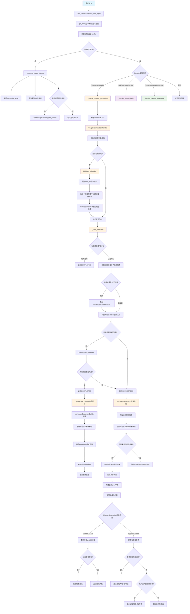

# 用户视角流程图（Roadmap）

## 用户旅程说明

1. 用户进入系统，上传OSS Readme或合规材料。
2. 系统自动解析、分析风险，展示待确认项。
3. 若有高/中风险项，用户需与AI/系统对话逐一确认。
4. 全部确认后，系统自动筛选合规项并生成合规报告/清单。
5. 若需要生成PCR文档，用户可进入PCR智能对话，系统引导多轮补全内容，最终生成/下载PCR文档。
6. 用户流程结束。
---
# 软件架构总览（Mermaid）

---

## `chat_service`类的流程详细示意
该流程图以双层嵌套的状态管理器为例。

---

## 架构分层与交互详细说明

### 1. OSS合规分析主流程（PocketFlow）
- 负责自动化解析、风险评估、依赖分析、用户交互确认、合规筛选和报告生成。
- 每个Node负责一个环节，数据通过shared字典流转。
- 用户交互节点（GetUserConfirming）可与AI对话，确认高/中风险项。
- 该流程的输出（合规清单、用户确认结果）可作为PCR生成的输入。

### 2. PCR智能生成流程（StateHandlers）
- 由ChatManager/ChatService统一管理会话和上下文。
- StateHandlerFactory根据当前状态和用户输入，分发到不同的Handler（如ObligationsHandler、ContentHandler等）。
- 每个Handler负责生成/补全PCR文档的某一部分内容，支持多轮追问、确认。
- 支持AI内容生成、知识库检索、子任务分解等。
- 最终由PCR结构化生成模块汇总所有片段，输出完整的PCR文档。

### 3. AI与知识库
- LLM_Analyzer.py统一AI调用入口，支持风险评估、内容生成、合规建议等。
- VectorDatabase为RAG和内容检索提供知识增强。
- 两大流程均可调用AI/知识库，提升自动化和智能化水平。

### 4. 前端
- 合规分析页面：文件上传、风险展示、合规确认。
- PCR生成页面：多轮对话，逐步完善PCR内容，支持保存/下载。
- 报告下载页面：统一展示合规报告和PCR文档。

---

## 两大流程的边界与衔接

- **PocketFlow主流程** 负责自动化与交互式的OSS合规分析，生成合规清单和报告。
- **StateHandlers流程** 负责根据用户输入和AI能力，驱动多轮对话，逐步生成结构化PCR文档。
- 两部分通过shared/session等机制可无缝衔接，既支持自动化，也支持灵活的人工/AI协作。
- 合规分析的结果（如高风险组件、用户确认内容）可作为PCR生成的输入，驱动后续多轮内容补全。