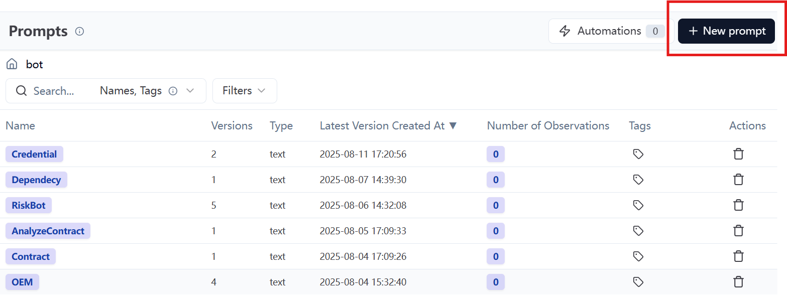

# StateHandler节点扩展指南

## 1. 状态处理器体系概览

### 1.1 基础状态处理器
- `SimpleStateHandler`: 单一状态处理基类
  - 主要处理简单的状态流转（next/continue）
  - 适用于单次确认或简单交互场景

### 1.2 复杂状态处理器
- `SubTaskStateHandler`: 子任务处理基类
  - 管理多个子任务的状态
  - 适用于组件、许可证等列表项确认
- `ContentGenerationHandler`: 内容生成基类
  - 处理固定章节内容生成
  - 管理内容生成和确认状态
- `ChapterGeneration`: 复合章节处理
  - 支持许可证任务 + 子标题处理的嵌套结构
  - 包含内容合并功能
- `SimpleChapterGeneration`: 简单章节处理
  - 仅处理子标题任务
  - 无需许可证级联处理

## 2. 节点类型选择指南

### 2.1 简单状态节点
适用场景：
- 单次用户确认（如OEM信息确认）
- 简单的是/否决策
- 无需循环处理的状态

示例：OEM状态处理
```python
# 1. 状态定义（item_types.py）
class ConfirmationStatus(Enum):
    OEM = "OEMing"

# 2. 处理器实现（back_end/services/state_handlers/object_handler/simple_handler.py）
class OEMHandler(SimpleStateHandler):
    
    # 简单状态的handler已在基类中实现

    def get_instructions(self) -> str:
        """处理OEM状态"""
        prompt = self.bot.langfuse.get_prompt("bot/OEM").prompt
        response = get_strict_json(self.bot, prompt)
        return response.get('talking', '请确认OEM信息')

# 3. 状态注册（在WorkflowContext中）
transition_table = {
    ConfirmationStatus.OEM: {
        State.COMPLETED.value: ConfirmationStatus.CONTRACT, # 完成后的下一状态
        State.INPROGRESS.value: ConfirmationStatus.OEM # 未完成时停留在当前状态
    }
}

# 4. 处理器注册（在handler_factory.py中）

# 状态处理器映射表
self._handlers = {
    ConfirmationStatus.OEM.value: OEMStateHandler(),
    ...
}

```

最后，在[Langfuse](http://140.231.236.162:8500/project/cmdh3nlkv0005pe07n90sru1k/prompts?pageIndex=0&pageSize=50&folder=bot)平台中创建对应的prompt，命名和代码中`get_prompt()`中的参数一致


### 2.2 子任务列表节点
适用场景：
- 组件列表确认
- 许可证列表审核
- 任何需要循环处理多个项目的场景

示例：依赖确认处理器

首先，确保在`node.py`中已经提前处理了待处理的数据在`shared`中，目前的嵌套节点仅支持`List[dict]`的形式。

```python
# 1. 配置定义（item_types.py）

class ItemType(Enum):
    """项目类型枚举"""
    LICENSE = "license"

TYPE_CONFIG = {
    ItemType.LICENSE: {
        "current_key": "current_license_idx", #用于在shared中维护目前确认的item索引
        "items_key": "checkedRisk", # 方便chat_manager去获取item列表，需与在shared中定义的键一致
        "error_msg": "错误：没有找到要确认的许可证",
        "name_field": "title", #在shared的字典中，用来表示待确认的item的名称的键
        "default_name": "未命名许可证",
        "instruction_template": "here is the licenseName: {title}, CheckedLevel: {CheckedLevel}, and Justification: {Justification}", # 用于在大状态中引导模型发送指导用户挨个确认item的指导文
        "instruction_fields": ["title", "CheckedLevel", "Justification"] # 方便chat_manager去找对应信息的placeholder，需与shared中的字典键一致，也需要与上面template的placeholder一致
    }
}

# 确认状态到处理类型的映射
CONFIRMATION_STATUS_TO_TYPE_MAP = {
    ConfirmationStatus.COMPLIANCE.value: ItemType.LICENSE.value,    # 合规性对应许可证处理
}

# 2. 处理器实现（chat_flow.py）
class DependencyHandler(SubTaskStateHandler):
    def initialize_subtasks(self, context: Dict[str, Any]):
        dependencies = context.get("shared", {}).get(
            TYPE_CONFIG[ItemType.DEPENDENCY]['items_key'], [] # 根据在Type_Config中配置的选项确定这里从哪里获取组件列表
        )
        self.subtasks = [dep.get("componentName", f"dep_{idx}") 
                        for idx, dep in enumerate(dependencies)]
        
    def is_subtask_completed(self, context: Dict[str, Any], subtask_id: str) -> bool:
        dependencies = context.get("shared", {}).get(
            TYPE_CONFIG[ItemType.DEPENDENCY]['items_key'], []
        )
        for dep in dependencies:
            if dep.get("componentName") == subtask_id:
                return dep.get("status") == ItemStatus.CONFIRMED.value
        return False

```

在`WorkflowContext`、`handler_factory`中的注册方法相同，不赘述，下文同

### 2.3 内容生成节点
适用场景：
- 需要用户确认的文本生成

示例：内容生成器
```python
# 1. 处理器实现（back_end\services\state_handlers\object_handler\simple_handler.py）
class ReportChapterHandler(ContentGenerationHandler):
    # 需要使用模型生成的类，就先在Langfuse上定义好，再直接引用
    def _generate_content(self, shared):
        prompt = self.bot.langfuse.get_prompt("bot/WriteProductOverview").prompt
        response = get_strict_json(self.bot, prompt)
        return response.get('talking', 'Please check the result for product overview')
    
    # 有硬编码生成的方法，可以直接导入来使用
    def _generate_content(self, shared):
        db = HardDB()
        db.load()
        result = generate_components_markdown_table(shared,db)
        return result
```
### 2.4 复合章节生成节点
适用场景：遍历项目+子标题的章节

```python
# 复合章节处理器
class PCRChapterHandler(ChapterGeneration):
    ```
    item_list_key确定从shared中的哪个键获取项目列表
    ```
    # 需要定义好get_instructions方法，具体参照上文
    def __init__(self, bot=None, item_list_key = TYPE_CONFIG[ItemType.PC]['items_key'],
                chapter_title_key = 'Obligations resulting from the use of 3rd party components',
                chapter_content_key = 'Generated Obligations resulting from the use of 3rd party components'):
        super().__init__(bot, item_list_key, chapter_title_key, chapter_content_key)

    # 定义创建子章节的方法
    def _create_content_handlers(self):
        """创建handler包装器列表，每个包装器包含共享的handler实例"""
        handlers = []
        # 实际开发时，仅需修改此列表，并相应地在后文中实现
        handler_classes = [
            LicenseHandler,
            SubObligationsHandler,
            SubRisksHandler,
            CommonRulesHandler,
            AdditionalHandler,
            ImplementationHandler,
            ObligationCombiningHandler, # 最后一定保证要有一个把各个项目的的子章节拼接的节点
        ]
        
        for handler_class in handler_classes:
            # 确保每个handler_class都继承自SubContentGenerationHandler
            if not issubclass(handler_class, SubContentGenerationHandler):
                self.logger.warning(f"{handler_class.__name__} 不是SubContentGenerationHandler的子类，可能无法正确管理状态")
            shared_handler = self.handler_registry.get_handler(handler_class)
            # 创建该实例的状态包装器
            handler_wrapper = HandlerStateWrapper(shared_handler)
            handlers.append(handler_wrapper)
        return handlers
```
对于上述中的每一个子标题生成器，需要以`SubContentGenerationHandler`为基类实例化类。
此处以`LicenseHandler`为例，将每一个方法重新实现即可。
```python
class LicenseHandler(SubContentGenerationHandler):

    def __init__(self, bot=None):
        super().__init__(bot)
        self.db = HardDB()
        self.db.load()

    def process_special_logic(self, shared, result = None, content = None):
        if content == None:
            return shared
        else:
            shared['Licenses_identified'] = content
            return shared

    def _generate_content(self, shared: Dict):
        current_item_idx = shared.get('current_item_idx', 0)
        components = shared.get(TYPE_CONFIG.get(ItemType.PC)['items_key'], [])
        global_licenses = self.db.find_license_by_component(components[current_item_idx]['compName'], 'global')
        other_licenses = self.db.find_license_by_component(components[current_item_idx]['compName'], other= True)
        global_str = "*Global Licenses:*" + ', '.join(global_licenses)
        other_str = "*Other Licenses:*" + ', '.join(other_licenses)
        return global_str + '\n\n' + other_str
    
    def get_instructions(self):
        return 'Now we have imported the licenses identified from the cli xml.'
```
### 2.5 简单章节生成节点
适用场景：仅有子标题的生成节点。
只需以`SimpleChapterGeneration`为基类实例化，定义每个子标题及其对应的内容生成方法即可。
```python
class SpecialConsiderationHandler(SimpleChapterGeneration):

    def __init__(self, bot=None, subcontent_factory = None, chapter_title_key = "Special Considerations", chapter_content_key = "generated_special_consideration"):
        super().__init__(bot,subcontent_factory, chapter_title_key, chapter_content_key)

    def get_instructions(self):
        prompt = '''Now switch to confirming mode, you should decide to continue when user is not satisfied with the result or go on when user is satisfied'''
        response = get_strict_json(self.bot, prompt)
        return response.get('talking', 'Please check the result for special considerations')
    
    def _create_content_handlers(self):
        """创建handler包装器列表，每个包装器包含共享的handler实例"""
        handlers = []
        handler_classes = [
            InteractionObligationHandler,
            CopyLeftHandler,
            AdditionalObligationHandler,
            OtherObligations,
            ReadmeOSS,
            SourceCodeHandler,
            RemainingHandler,
            SpecialCombiningHandler
        ]
        
        for handler_class in handler_classes:
            # 确保每个handler_class都继承自SubContentGenerationHandler
            if not issubclass(handler_class, SubContentGenerationHandler):
                self.logger.warning(f"{handler_class.__name__} 不是SubContentGenerationHandler的子类，可能无法正确管理状态")
            shared_handler = self.handler_registry.get_handler(handler_class)
            # 创建该实例的状态包装器
            handler_wrapper = HandlerStateWrapper(shared_handler)
            handlers.append(handler_wrapper)
        return handlers

```

## 3. 最佳实践

### 3.1 状态设计原则
1. 状态粒度适中，避免过于复杂的状态转换
2. 清晰的状态名称和合理的状态分层
3. 合理使用状态包装器复用代码

### 3.2 处理器实现建议
1. 单一职责原则：一个处理器只负责一类任务
2. 错误处理：合理使用异常处理和状态检查
3. 上下文管理：谨慎管理context中的共享数据

### 3.3 提示词管理
1. 统一在Langfuse平台管理提示词
2. 提示词ID命名规范：bot/[状态名称]
3. 合理使用模板占位符

### 3.4 测试建议
1. 编写单元测试覆盖状态转换逻辑
2. 模拟复杂场景的集成测试
3. 提示词效果验证测试
