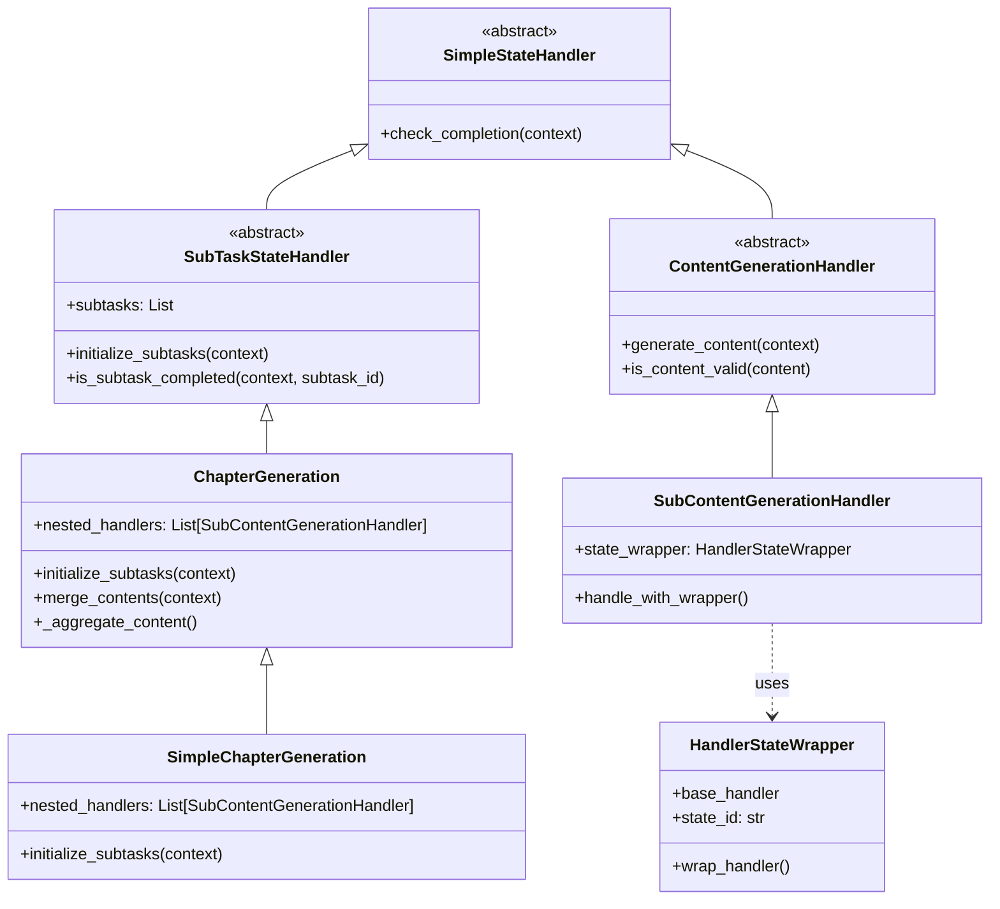

# 工具使用说明

## 1. 依赖环境与安装

### 1.1 Python环境
- 推荐 Python 3.10 及以上版本。
- 建议使用虚拟环境（venv 或 conda）。

### 1.2 安装依赖包
在项目根目录下执行：

```powershell
pip install -r requirements.txt
```

如需 OCR、AI、文档处理等高级功能，需额外安装：

```powershell
pip install spire.doc beautifulsoup4
```

## 2. 启动服务器

### 2.1 FastAPI 后端服务
在 `back_end` 目录下运行：

```powershell
python run_server.py
```

或

```powershell
python server.py
```

默认监听端口为 8000，可通过 http://localhost:8000/docs 访问 API 文档。

### 2.2 前端
请参考前端项目 [README](https://code.siemens.com/zhi-dian.huang.ext/third-party-clearance-client-frontend)。

## 3. `PocketFlow`节点编排与工作流

### 3.1 PocketFlow 节点定义
所有节点定义在 `nodes.py`，包括：
- `ParsingOriginalHtml`：解析原始 OSS Readme
- `LicenseReviewing`：风险评估
- `SpecialLicenseCollecting`：特殊许可证收集
- `RiskCheckingRAG`：RAG 风险复核
- `DependencyCheckingRAG`：依赖分析
- `initializeSession`：会话初始化
- `itemFiltering`：用户确认过滤
- `getFinalOSS`：生成最终合规文档
- `ParsingPCR`：PCR 文档解析

### 3.2 工作流编排
主流程定义在 `flow.py`，如 `pre_chat_flow`、`post_chat_flow` 等。
可根据业务需求自定义节点顺序和参数。

#### 示例：自定义工作流
```python
from pocketflow import Flow
from nodes import ParsingOriginalHtml, LicenseReviewing, ...

my_flow = Flow([
    ParsingOriginalHtml(),
    LicenseReviewing(),
    ...
])
my_flow.run(shared={...})
```

### 3.3 节点扩展
如需扩展新节点，继承 `Node` 或 `BatchNode`，实现 `prep`、`exec`、`post` 方法。

## 4. `StateHandler`节点编排与工作流

`StateHandler`节点用于在对话中管理对话状态，并封装了各个状态中的特殊内容生成方法和状态流转方法。
- `SimpleStateHandler`: 仅处理简单状态，根据模型的next或continue结果判断是否进入下一个状态
  - `SubTaskStateHandler`：基于上一层基类，扩展了根据组件、许可证数量生成对应子任务，并在`Chat_manager`类中管理每个项目的循环
    - `ChapterGeneration`: 基于上一层基类，扩展了基于许可证生成子任务的同时，再嵌套多个`SubContentGenerationHandler`子标题处理的方法，并新增了内容合并的方法
      - `SimpleChapterGeneration`：基于上一层基类，重新实现了生成子任务的方法，即仅嵌套各个子标题
  - `ContentGenerationHandler`：基于上一层基类，扩展了生成固定章节内容、管理内容是否生成、用户是否确认的状态
    - `SubContentGenerationHandler`：基于上一层基类，扩展了和包装器`HandlerStateWrapper`兼容的方法，方便多个子标题处理共享一个处理器，减少实例化耗时。

图表说明如下


详细的节点编排方式请参照此文档[StateHandler管理方法](../README_Doc/StateHandler_Guide.md)

## 5. 测试

测试代码位于 `back_end/test_codes/`，可直接运行：

```powershell
python -m back_end.test_codes.testing
```

## 5. 其他说明

- 配置文件、数据库等请参考各自模块 README 或注释。
- 日志配置见 `log_config.py`。
- 详细架构与流程请参考本文件前述章节及流程图。